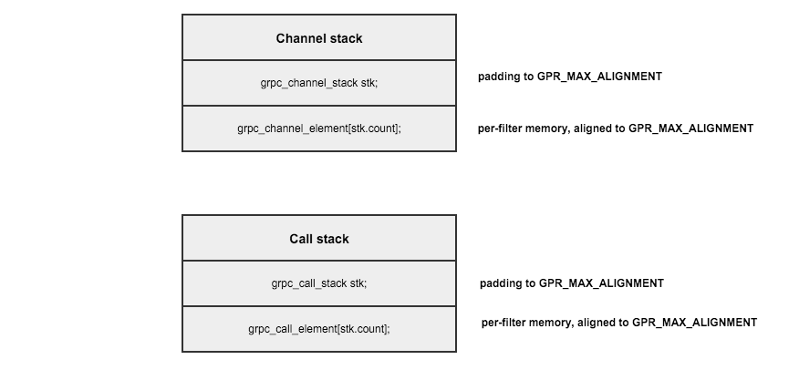

### Channel

grpc/src/core/channel/

This is a important code, channel and stub are basic in gRPC.

#### channel_args

grpc channel args functions, include copy and add.

include from `<grpc/compression.h>`.

```c
grpc_channel_args *grpc_channel_args_copy_and_add(const grpc_channel_args *src,
                                                  const grpc_arg *to_add,
                                                  size_t num_to_add) {
  grpc_channel_args *dst = gpr_malloc(sizeof(grpc_channel_args));
  size_t i;
  size_t src_num_args = (src == NULL) ? 0 : src->num_args;
  if (!src && !to_add) {
    dst->num_args = 0;
    dst->args = NULL;
    return dst;
  }
  dst->num_args = src_num_args + num_to_add;
  dst->args = gpr_malloc(sizeof(grpc_arg) * dst->num_args);
  for (i = 0; i < src_num_args; i++) {
    dst->args[i] = copy_arg(&src->args[i]);
  }
  for (i = 0; i < num_to_add; i++) {
    dst->args[i + src_num_args] = copy_arg(&to_add[i]);
  }
  return dst;
}
```
grpc channel args compress algorithm.

```c
grpc_compression_algorithm grpc_channel_args_get_compression_algorithm(
    const grpc_channel_args *a) {
  size_t i;
  if (a == NULL) return 0;
  for (i = 0; i < a->num_args; ++i) {
    if (a->args[i].type == GRPC_ARG_INTEGER &&
        !strcmp(GRPC_COMPRESSION_ALGORITHM_ARG, a->args[i].key)) {
      return (grpc_compression_algorithm)a->args[i].value.integer;
      break;
    }
  }
  return GRPC_COMPRESS_NONE;
}

grpc_channel_args *grpc_channel_args_set_compression_algorithm(
    grpc_channel_args *a, grpc_compression_algorithm algorithm) {
  grpc_arg tmp;
  tmp.type = GRPC_ARG_INTEGER;
  tmp.key = GRPC_COMPRESSION_ALGORITHM_ARG;
  tmp.value.integer = algorithm;
  return grpc_channel_args_copy_and_add(a, &tmp, 1);
}
```

#### channel_stack

Channel filter 实现了 Channel 上的操作。Channel stack 提供了一种机制去初始化 Channel Filter。


A channel filter defines how operations on a channel are implemented. Channel filters are chained together to create full channels, and if those chains are linear, then channel stacks provide a mechanism to minimize allocations for that chain. Call stacks are created by channel stacks and represent the per-call data for that stack.

```c
typedef struct grpc_channel_element grpc_channel_element;
typedef struct grpc_call_element grpc_call_element;

typedef struct grpc_channel_stack grpc_channel_stack;
typedef struct grpc_call_stack grpc_call_stack;

typedef struct {
  grpc_channel_stack *channel_stack;
  const grpc_channel_args *channel_args;
  int is_first;
  int is_last;
} grpc_channel_element_args;

typedef struct {
  grpc_call_stack *call_stack;
  const void *server_transport_data;
  grpc_call_context_element *context;
} grpc_call_element_args;
```

Channel filters specify:

1. the amount of memory needed in the channel & call (via the sizeof\_XXX members)
2. functions to initialize and destroy channel & call data (init\_XXX, destroy\_XXX)
3. functions to implement call operations and channel operations (call\_op, channel\_op)
4. a name, which is useful when debugging

Members are laid out in approximate frequency of use order.

Stack 内部的顺序一般来说最大几率是按照使用的顺序来排序。

##### grpc\_channel\_filter

```c
typedef struct {
  /* send\/receive 数据的时候调用 */
  /* See grpc_call_next_op on how to call the next element in the stack */
  void (*start_transport_stream_op)(grpc_exec_ctx *exec_ctx,
                                    grpc_call_element *elem,
                                    grpc_transport_stream_op *op);
  /* 当处理 channel 级的调用的时候使用该函数，e.g. new calls, transport closure
     See grpc_channel_next_op on how to call the next element in the stack */
  void (*start_transport_op)(grpc_exec_ctx *exec_ctx,
                             grpc_channel_element *elem, grpc_transport_op *op);

  /* sizeof(per call data) */
  size_t sizeof_call_data;
  /* 初始化 per call data
     Initialize per call data.
     elem is initialized at the start of the call, and elem->call_data is what
     needs initializing.
     The filter does not need to do any chaining. (重要)
     server_transport_data is an opaque pointer. If it is NULL, this call is
     on a client;
     if it is non-NULL, then it points to memory owned by the
     transport and is on the server. Most filters want to ignore this
     argument. */
  void (*init_call_elem)(grpc_exec_ctx *exec_ctx, grpc_call_element *elem,
                         grpc_call_element_args *args);
  void (*set_pollset)(grpc_exec_ctx *exec_ctx, grpc_call_element *elem,
                      grpc_pollset *pollset);
  /* 销毁 per call data
     Destroy per call data.
     The filter does not need to do any chaining */
  void (*destroy_call_elem)(grpc_exec_ctx *exec_ctx, grpc_call_element *elem);

  /* sizeof(per channel data) */
  size_t sizeof_channel_data;
  /* 初始化 per-channel data
     Initialize per-channel data.
     is_first, is_last 指明了改元素在 stack 中的位置
     is_first, is_last designate this elements position in the stack, and are
     useful for asserting correct configuration by upper layer code.
     The filter does not need to do any chaining */
  void (*init_channel_elem)(grpc_exec_ctx *exec_ctx, grpc_channel_element *elem,
                            grpc_channel_element_args *args);
  /* 销毁 per-channel data
     Destroy per channel data.
     The filter does not need to do any chaining */
  void (*destroy_channel_elem)(grpc_exec_ctx *exec_ctx,
                               grpc_channel_element *elem);

  /* Implement grpc_call_get_peer() */
  char *(*get_peer)(grpc_exec_ctx *exec_ctx, grpc_call_element *elem);

  /* The name of this filter */
  /* debug 的时候使用 */
  const char *name;
} grpc_channel_filter;
```

##### grpc\_channel\_element

A channel_element tracks its filter and the filter requested memory within a channel allocation.

```c
struct grpc_channel_element {
  const grpc_channel_filter *filter;
  void *channel_data;
};
```

##### grpc\_call\_element

A call_element tracks its filter, the filter requested memory within a channel allocation, and the filter requested memory within a call allocation.

```c
struct grpc_call_element {
  const grpc_channel_filter *filter;
  void *channel_data;
  void *call_data;
};
```

##### grpc\_channel\_stack

A channel stack tracks a set of related filters for one channel, and guarantees they live within a single malloc() allocation.

```c
struct grpc_channel_stack {
  grpc_stream_refcount refcount;
  size_t count;
  /* Memory required for a call stack (computed at channel stack
     initialization) */
  size_t call_stack_size;
};
```

##### grpc\_call\_stack

A call stack tracks a set of related filters for one call, and guarantees they live within a single malloc() allocation.

```c
struct grpc_call_stack {
  /* shared refcount for this channel stack.
     MUST be the first element: the underlying code calls destroy
     with the address of the refcount, but higher layers prefer to think
     about the address of the call stack itself. */
  grpc_stream_refcount refcount;
  size_t count;
};
```

Methods:

```c
/* Get a channel element given a channel stack and its index */
grpc_channel_element *grpc_channel_stack_element(grpc_channel_stack *stack,
                                                 size_t i);
/* Get the last channel element in a channel stack */
grpc_channel_element *grpc_channel_stack_last_element(
    grpc_channel_stack *stack);
/* Get a call stack element given a call stack and an index */
grpc_call_element *grpc_call_stack_element(grpc_call_stack *stack, size_t i);

/* Determine memory required for a channel stack containing a set of filters */
size_t grpc_channel_stack_size(const grpc_channel_filter **filters,
                               size_t filter_count);
/* Initialize a channel stack given some filters */
void grpc_channel_stack_init(grpc_exec_ctx *exec_ctx, int initial_refs,
                             grpc_iomgr_cb_func destroy, void *destroy_arg,
                             const grpc_channel_filter **filters,
                             size_t filter_count, const grpc_channel_args *args,
                             const char *name, grpc_channel_stack *stack);
/* Destroy a channel stack */
void grpc_channel_stack_destroy(grpc_exec_ctx *exec_ctx,
                                grpc_channel_stack *stack);

/* Initialize a call stack given a channel stack. transport_server_data is
   expected to be NULL on a client, or an opaque transport owned pointer on the
   server. */
void grpc_call_stack_init(grpc_exec_ctx *exec_ctx,
                          grpc_channel_stack *channel_stack, int initial_refs,
                          grpc_iomgr_cb_func destroy, void *destroy_arg,
                          grpc_call_context_element *context,
                          const void *transport_server_data,
                          grpc_call_stack *call_stack);
/* Set a pollset for a call stack: must occur before the first op is started */
void grpc_call_stack_set_pollset(grpc_exec_ctx *exec_ctx,
                                 grpc_call_stack *call_stack,
                                 grpc_pollset *pollset);

/* Destroy a call stack */
void grpc_call_stack_destroy(grpc_exec_ctx *exec_ctx, grpc_call_stack *stack);

/* Ignore set pollset - used by filters to implement the set_pollset method
   if they don't care about pollsets at all. Does nothing. */
void grpc_call_stack_ignore_set_pollset(grpc_exec_ctx *exec_ctx,
                                        grpc_call_element *elem,
                                        grpc_pollset *pollset);
/* Call the next operation in a call stack */
void grpc_call_next_op(grpc_exec_ctx *exec_ctx, grpc_call_element *elem,
                       grpc_transport_stream_op *op);
/* Call the next operation (depending on call directionality) in a channel
   stack */
void grpc_channel_next_op(grpc_exec_ctx *exec_ctx, grpc_channel_element *elem,
                          grpc_transport_op *op);
/* Pass through a request to get_peer to the next child element */
char *grpc_call_next_get_peer(grpc_exec_ctx *exec_ctx, grpc_call_element *elem);

/* Given the top element of a channel stack, get the channel stack itself */
grpc_channel_stack *grpc_channel_stack_from_top_element(
    grpc_channel_element *elem);
/* Given the top element of a call stack, get the call stack itself */
grpc_call_stack *grpc_call_stack_from_top_element(grpc_call_element *elem);

void grpc_call_log_op(char *file, int line, gpr_log_severity severity,
                      grpc_call_element *elem, grpc_transport_stream_op *op);

void grpc_call_element_send_cancel(grpc_exec_ctx *exec_ctx,
                                   grpc_call_element *cur_elem);
```

#### channel_stack 内存管理



```c
Channel stack is laid out as: {
     grpc_channel_stack stk;
     padding to GPR_MAX_ALIGNMENT
     grpc_channel_element[stk.count];
     per-filter memory, aligned to GPR_MAX_ALIGNMENT
}

Call stack is laid out as: {
     grpc_call_stack stk;
     padding to GPR_MAX_ALIGNMENT
     grpc_call_element[stk.count];
     per-filter memory, aligned to GPR_MAX_ALIGNMENT
}
```

##### Padding function define

```c
#define ROUND_UP_TO_ALIGNMENT_SIZE(x) \
  (((x) + GPR_MAX_ALIGNMENT - 1u) & ~(GPR_MAX_ALIGNMENT - 1u))
```

##### channel/call stack init

```c
void grpc_channel_stack_init(grpc_exec_ctx *exec_ctx, int initial_refs,
                             grpc_iomgr_cb_func destroy, void *destroy_arg,
                             const grpc_channel_filter **filters,
                             size_t filter_count,
                             const grpc_channel_args *channel_args,
                             const char *name, grpc_channel_stack *stack) {
  /* init memory with padding function */
  /* get call size by use grpc_call_stack and filter count and grpc_call_element */
  size_t call_size =
      ROUND_UP_TO_ALIGNMENT_SIZE(sizeof(grpc_call_stack)) +
      ROUND_UP_TO_ALIGNMENT_SIZE(filter_count * sizeof(grpc_call_element));
      
  /* init data */
  grpc_channel_element *elems;
  grpc_channel_element_args args;
  char *user_data;
  size_t i;

  stack->count = filter_count;
  /* transport\/transport.h */
  GRPC_STREAM_REF_INIT(&stack->refcount, initial_refs, destroy, destroy_arg,
                       name);
  /* elems size from stack */
  elems = CHANNEL_ELEMS_FROM_STACK(stack);
  /* get user data size by elems and padding mem from filter count and channel elem */
  user_data =
      ((char *)elems) +
      ROUND_UP_TO_ALIGNMENT_SIZE(filter_count * sizeof(grpc_channel_element));

  /* init per-filter data */
  for (i = 0; i < filter_count; i++) {
    /* channel_args pointer to stack */
    args.channel_stack = stack;
    args.channel_args = channel_args;
    args.is_first = i == 0;
    args.is_last = i == (filter_count - 1);
    elems[i].filter = filters[i];
    elems[i].channel_data = user_data;
    /* filter init channel element */
    elems[i].filter->init_channel_elem(exec_ctx, &elems[i], &args);
    user_data += ROUND_UP_TO_ALIGNMENT_SIZE(filters[i]->sizeof_channel_data);
    call_size += ROUND_UP_TO_ALIGNMENT_SIZE(filters[i]->sizeof_call_data);
  }

  stack->call_stack_size = call_size;
}
```

##### channel/call destory

```c
void grpc_channel_stack_destroy(grpc_exec_ctx *exec_ctx,
                                grpc_channel_stack *stack) {
  grpc_channel_element *channel_elems = CHANNEL_ELEMS_FROM_STACK(stack);
  size_t count = stack->count;
  size_t i;

  /* destroy per-filter data */
  for (i = 0; i < count; i++) {
    channel_elems[i].filter->destroy_channel_elem(exec_ctx, &channel_elems[i]);
  }
}
```

##### gRPC channel/call next op

```c
void grpc_channel_next_op(grpc_exec_ctx *exec_ctx, grpc_channel_element *elem,
                          grpc_transport_op *op) {
  /* the same as below */
  grpc_channel_element *next_elem = elem + 1;
  next_elem->filter->start_transport_op(exec_ctx, next_elem, op);
}

void grpc_call_next_op(grpc_exec_ctx *exec_ctx, grpc_call_element *elem,
                       grpc_transport_stream_op *op) {
  /* get next element from call elements */
  grpc_call_element *next_elem = elem + 1;
  /* use filter from callelement */
  next_elem->filter->start_transport_stream_op(exec_ctx, next_elem, op);
}
```

#### connected_channel.h

1. void grpc\_connected\_channel\_bind\_transport
2. grpc\_stream* grpc\_connected\_channel\_get\_stream

A channel filter representing a channel that is on a connected transport. This filter performs actual sending and receiving of messages.

这个文件里定义了一个 `grpc_connected_channel_filter`，在已经连接上的传输层中执行发送和接收信息。

```c
extern const grpc_channel_filter grpc_connected_channel_filter;
```

检查 gRPC channel 连接状态的函数，其他代码可以使用该实现。

1. grpc_connectivity_state grpc_client_channel_check_connectivity_state
2. void grpc_client_channel_watch_connectivity_state

#### conntected_channel.c

1. connected\_channel\_channel\_data
2. connected\_channel\_call\_data

```c
typedef struct connected_channel_channel_data {
  grpc_transport *transport;
} channel_data;

typedef struct connected_channel_call_data { void *unused; } call_data;
```

我们在这里需要去看 [Transport](transport.md) 的实现。
