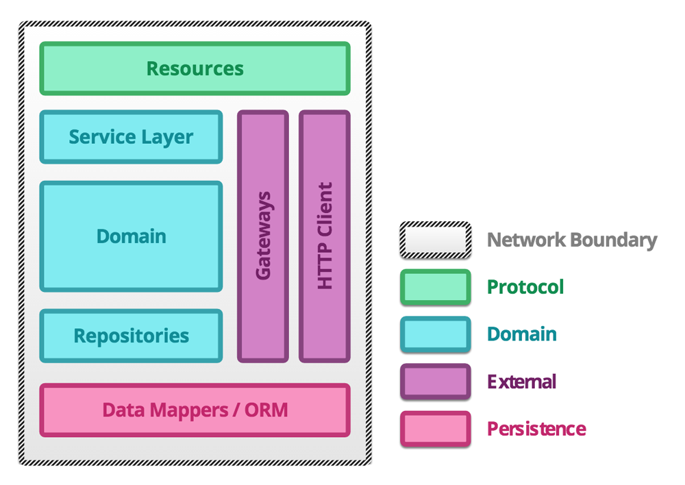
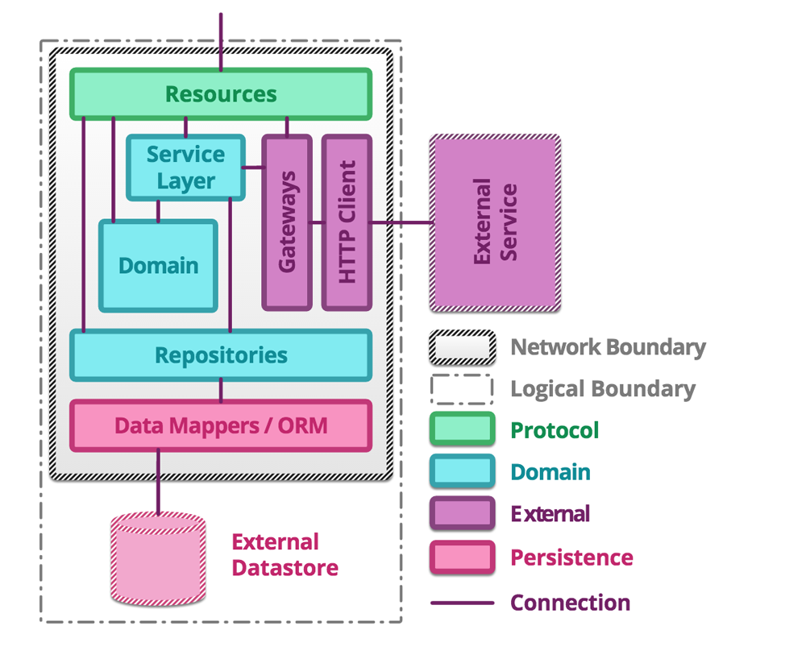
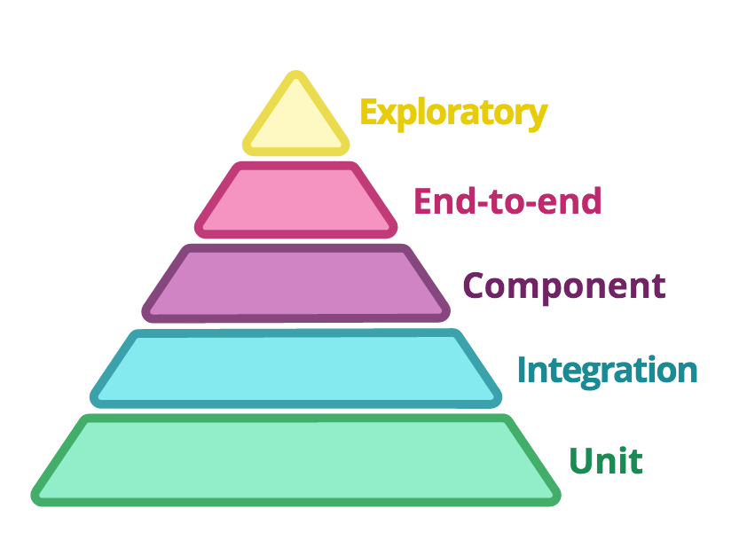
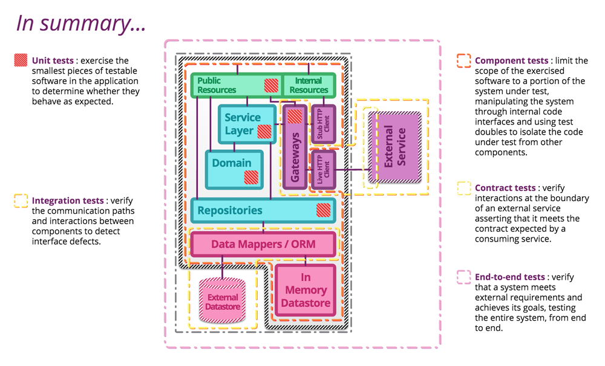

### Microservice

[Microservice PPT](http://martinfowler.com/articles/microservice-testing/#anatomy-modules)

Any testing strategy employed should aim to provide coverage to each layer and between layers of the service whilst remaining lightweight.

**Resources** act as mappers between the application protocol exposed by the service and messages to objects representing the domain. Typically, they are thin, with responsibility for sanity checking the request and providing a protocol specific response according to the outcome of the business transaction.

Almost all of the service logic resides in a domain model representing the business domain. Of these objects, services coordinate across multiple domain activities, whilst repositories act on collections of domain entities and are often persistence backed.

If one service has another service as a collaborator, some logic is needed to communicate with the external service. **A gateway encapsulates message passing with a remote service**, marshalling requests and responses from and to domain objects. It will likely use a client that understands the underlying protocol to handle the request-response cycle.

Microservices handle requests by passing messages between each of the relevant modules to form a response. A particular request may require interaction with services, gateways or repositories and so the connections between modules are loosely defined.

Automated tests should provide coverage for each of these communications at the finest granularity possible. Thus, each test provides a focussed and fast feedback cycle.

### Unit Test

[Sociable unit testing](https://leanpub.com/wewut) focusses on testing the behaviour of modules by observing changes in their state. This treats the unit under test as a black box tested entirely through its interface.

[Solitary unit testing](https://leanpub.com/wewut) looks at the interactions and collaborations between an object and its dependencies, which are replaced by [test doubles](http://martinfowler.com/bliki/TestDouble.html).

### Integration Testing

When writing automated tests of the modules which interact with external components, the goal is to verify that the module can communicate sufficiently rather than to acceptance test the external component. As such, **tests of this type should aim to cover basic success and error paths through the integration module**

### Gateway integration tests

Allow any protocol level errors such as missing HTTP headers, incorrect SSL handling or request/response body mismatches to be flushed out at the finest testing granularity possible..

BUT

However, without a more coarse grained suite of tests, we cannot be sure that the microservice works together as a whole to satisfy business requirements.

### Component Testing

A component is any well-encapsulated, coherent and independently replaceable part of a larger system.

**In a microservice architecture, the components are the services themselves**

### Contract Testing

When the components involved are microservices, the interface is the public API exposed by each service. The maintainers of each consuming service write an independent test suite that verifies only those aspects of the producing service that are in use.

### End-2-End Testing

As a microservice architecture includes more moving parts for the same behaviour, end-to-end tests provide value by adding coverage of the gaps between the services.

### Writing and maintaining end-to-end tests can be very difficult

①	Write as few end-to-end tests as possible
②	Focus on personas and user journeys
③	Choose your ends wisely
④	Rely on infrastructure-as-code for repeatability
⑤	Make tests data-independent

The test pyramid helps us to maintain a balance between
the different types of test.

In summary:

