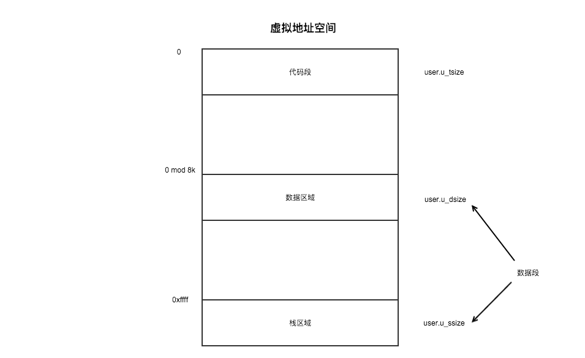

### 内存分配

代码段时只读的，user.u_tsize 表示了代码段的长度，代码段通过 text[] 进行管理。

数据段用来存放程序使用的数据的，数据段时不会被进程共享的。

数据段的物理地址和长度分别由 `proc.p_addr` 和 `proc.p_size` 表示。数据段从低位地址开始，依次有下3个部分组成。

PPDA（Per Process Data Area）

1. User 结构体的内核栈区域构成
2. 长度为 USIZE * 64 字节 ＝ 1KB，从用户空间无法访问
3. 内核栈区域被用作内核处理时临时的工作区域，每个进程都具有供内核模式使用的工作区域

虚拟地址空间

进程拥有 64 KB 的虚拟地址空间，通过长度为 16 比特的虚拟地址访问物理内存。虚拟地址由 MMU 转换成长度为 18 比特的物理地址。

代码段位于虚拟地址空间最低位的地址，其后为数据区域，数据区域的起始地址以 8KB 为边界对其，栈区域被分配在虚拟地址空间的最高地址。

每个进程都有独立的虚拟地址空间。但进程间共享代码段时可以不受这个限制。

在虚拟地址空间中，数据区域和栈区域可被视作不同的段。内核味了使数据区域和栈区域称为不同的段（页），对 ARP 进行了设定。因此，在虚拟地址空间中，也可以把数据区域和栈区域分别称为数据段和栈段。

优点：

1. 程序能够使用以任意地址为起点的内存空间
2. 实现对内存访问的管理
3. 提高内存的使用效率